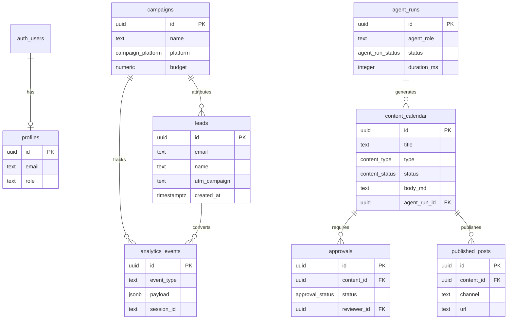

# Supabase ERD — Marketing AI Team

Task #2 산출물 | 마이그레이션: `supabase/migrations/`

## 엔티티 관계



## RLS 요약

| 테이블 | anon | authenticated (admin) |
|--------|------|-------------------------|
| leads | ❌ INSERT 차단 | ✅ CRUD |
| content_calendar | ❌ | ✅ CRUD |
| approvals | ❌ | ✅ CRUD |
| 기타 전부 | ❌ | ✅ CRUD |

Task #6: `submit-lead` Edge Function이 service_role로 leads INSERT.

## 적용 방법

```powershell
cd "$env:USERPROFILE\Desktop\marketing"

# 1. Supabase 대시보드에서 프로젝트 생성
# 2. .env에 키 추가 (NEXT_PUBLIC_SUPABASE_URL, NEXT_PUBLIC_SUPABASE_ANON_KEY, SUPABASE_SERVICE_ROLE_KEY)
# 3. CLI 연결 (선택)
npx supabase login
npx supabase link --project-ref <your-project-ref>
npx supabase db push

# 또는 SQL Editor에 20260619000001_marketing_core_schema.sql 붙여넣기
```

## 첫 admin 사용자

1. Supabase Auth에서 이메일 사용자 생성
2. `profiles`에 자동 생성됨 (`handle_new_user` 트리거)
3. `role = 'admin'` 확인